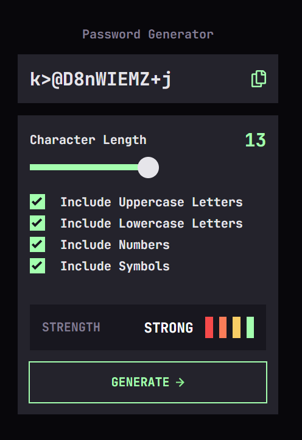
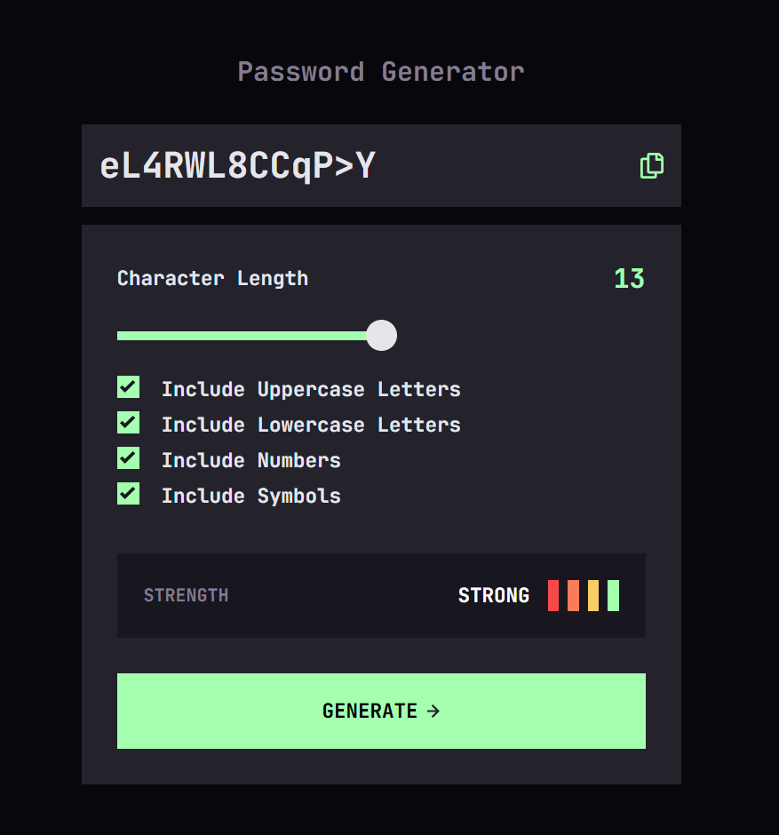

# Password Generator App

This is a solution to the [Password Generator App on Frontend Mentor](https://www.frontendmentor.io/challenges/password-generator-app-Mr8CLycqjh). The challenge involves creating a pasword generator that creates a pasword for it's user based on the criteria of password length and of the the type of characters used in the password. Upon generation, a strength indicator will give the strength of the password, also allowing the user to copy the password to the clipboard and paste where needed.

## Table of Contents

- [Overview](#overview)
  - [The Challenge](#the-challenge)
  - [Screenshots](#screenshots)
  - [Links](#links)
- [My Process](#my-process)
  - [Built With](#built-with)
  - [What I Learned](#what-i-learned)
  - [Continued Development](#continued-development)
- [Setup](#setup)
- [Author](#author)

## Overview

### The Challenge

Users should be able to:

- Generate a password based on the selected inclusion options.
- Copy the generated password to the computer's clipboard
- See a strength rating for their generated password
- View the optimal layout for the interface depending on their device's screen size
- See hover and focus states for all interactive elements on the page

### Screenshots

#### Mobile (375px)

#### Tablet/Desktop (768px)

### Links

- Solution URL: [GitHub Repository](https://github.com/bmeinert8/password-generator-app/)
- Live Site URL: [Live Demo](https://bmeinert8.github.io/password-generator-app/)

## My Process

### Built With

- Semantic HTML5 markup
- CSS custom properties
- Flexbox for layout
- Mobile-first workflow
- Vanilla JavaScript for calculations and interactivity
- Git and GitHub for version control

### What I Learned

- Improved my understanding of javascript functionality and creating custom inputs
- Gained experience with JavaScript event listeners and DOM manipulation for dynamic generation.
- Learned to copy API and utilizing the clipboard.

### Continued Development

I plan to enhance this project with additional features, including:

- Add a regenerate button to the generator.
- Add a toggle to change password visibility.
- Add a simple animation to the password strength bars.

## Setup

To run this project locally:

1. Clone the repository: `git clone https://github.com/your-username/password-generator-app.git`
2. Navigate to the project directory: `cd password-generator-app`
3. Open `index.html` in a browser, or use a local server (e.g., VS Code Live Server).

## Author

- Name: [Brian Meinert]
- Frontend Mentor: [@bmeinert8](https://www.frontendmentor.io/profile/bmeinert8)
- GitHub: [bmeinert8](https://github.com/bmeinert8)